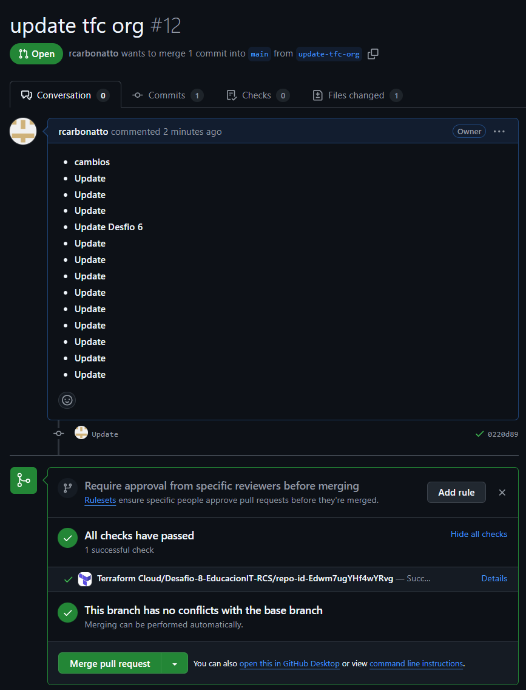

#  Terraform & Github Action- Desafío 5
*A Implementar: https://developer.hashicorp.com/terraform/tutorials/automation/github-actions*

## Español

**Fecha:** 26-Septiembre-2024  
**Autor:** Rodrigo Carbonatto Sarlengo  
**Título:** Desafío 8 - Bootcamp DevOps

### Pre-Requisitos
1. GitHub Account
2. HCP Terraform Account
3. AWS Account

### HCP Terraform Configuracion
1. Ingresamos a la pagina https://app.terraform.io/ y creamos un Worskpace
2. Dentro del Workspace creamos un API-driven workflow
    Opcional: Si desea conectarse a HCP Terraform desde el CLI
    1. Correr `terraform login` , hacr click en la pagina que nos muestra la salida y crear un token
    2. Copiar el Key y pegarlo una vez en la terminal donde corrimos terraform login, dar Enter. 
3. Creamos las variables que permitiran conectar a AWS 
    1. Vamos al portal de Amazon, seleccionamos el usuario qeu utilizaremos y creamos una Access Key
    2. En Terraform HCP vamos al Worspace - Settings - Variable Sets y Create Variable Set
    3. Colocamos un Nombre, el Scope lo aplicamos al proyecto o workspace que utilizaremos
    4. En la seccion Variable seleccionamos Add Variable y luego seleccionamos Enviroment Variable
    5. Creamos las variables necesarias: 
        1. AWS_ACCESS_KEY_ID: Colocamos la AccessKey y seleccionamos Sensitive
        2. AWS_SECRET_ACCESS_KEY: Colocamos la SecretKey y seleccionamos Sensitive
        3. AWS_SESSION_TOKEN: En caso de usar usuario temporal (AWS Academy por ejemplo), ponemos el Session Token
6. Creamos el token que usaremos para Github Action
    1. Vamos a Account Settings - Tokens
    2. Seleccionamos Create an Api Token - nombre: Github Action
    3. Con esto se crea la Key y se conecta con nuestro repositorio de GitHub

### Crear Repositorio
1. Usaremos el repositorio en: https://github.com/hashicorp-education/learn-terraform-github-actions como template 
2. Realizamos Fork del repositorio con `gh repo fork https://github.com/hashicorp-education/learn-terraform-github-actions.git` y lo clonamos en el repositorio que usaremos
3. Desde la terminal ponemos `git add "Ruta_de_carpeta_del_Clone"`, hacemos `git commit -m "mensaje"` y luego `git push`
4. En el Repositorio que creamos vamos a Settings - Secrets and variable - Actions - New Repository Secret. POnemos el token generado en el paso anterior con nombre TF_API_TOKEN

### Configurando Template de Terraform
1. en el archivo Terraform-plan.yml y terraform-apply.yml cambiamos los `env` a: 
    TF_CLOUD_ORGANIZATION: "Desafio-8-EducacionIT-RCS" *Nombre del Worskpace creado*
    TF_API_TOKEN: "${{ secrets.TF_API_TOKEN }}" *Nombre del secret creado*
    TF_WORKSPACE: "BootCamp-DevOps"
    CONFIG_DIRECTORY: "./Desafio_8/learn-terraform-github-actions"

### Crear Pull Request
1. Creamos una branch: git checkout -b 'update-tfc-org'
2. Realizamos un cambio y agregamos el cambio: git add .
3. Hacemos commmit git commit -m "mensaje"
4. Hacemos Push de los cambios: git push origin update-tfc-org
5. Hacemos la solicitud de Pull Request: gh pr create y seguimos los pasos

### Aprobar Pull Request
1. Desde la web de Github vamos a Pull Request
2. Nos aparecera un cartel el cual nos llevara a la pagina de Terraform para aprobar la implementacion

### Ejecucioncd 
1. Pull Request en GitHub 
2. Veremos en la parte inferior el Plan que finalizo y muestra que se va a crear, cambiar, etc 
3. Aprobamos el Pull Request en Github y una vez realizado vamos al Workspace en Terraform y podemos aplicar los cambios 
4. Prueba de Output en terraform, instancia creada en AWS y acceso al webserver 
5. Finalmente Destruimos todos los recursos creados para este Desafio.

    

